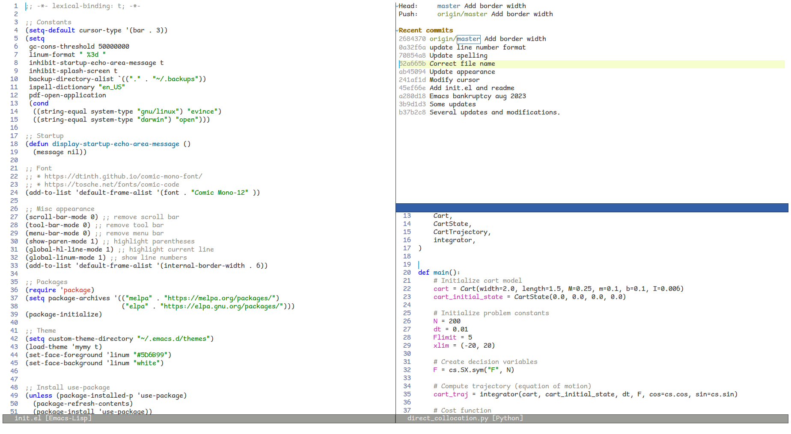

# dotemacs

I have declared [dot Emacs bankruptcy](https://www.emacswiki.org/emacs/DotEmacsBankruptcy) several times over the years, and this is the latest incarnation of my initialization.
The current version has been designed to be minimalistic and easy to maintain.

Currently, I am running GNU Emacs 26.3 (build 2, x86_64-pc-linux-gnu, GTK+ Version 3.24.14) of 2020-03-26, modified by Debian.
