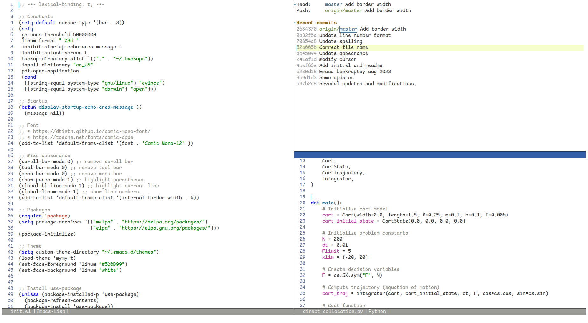

# dotemacs

I have declared [dot Emacs bankruptcy](https://www.emacswiki.org/emacs/DotEmacsBankruptcy) several times over the years, and this is the latest incarnation of my initialization.
The current version has been designed to be minimalistic and easy to maintain.

Currently, I am running Emacs 29.4.50 built from source.
